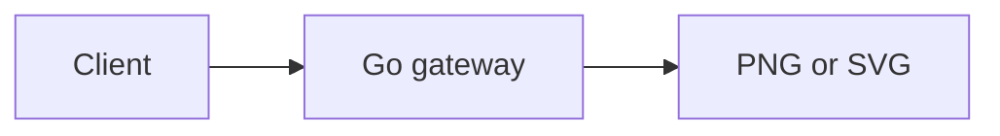
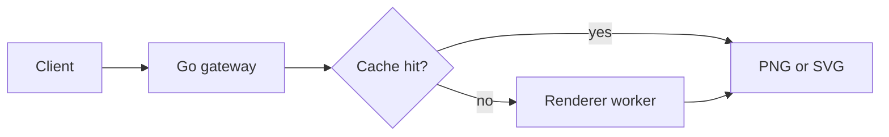
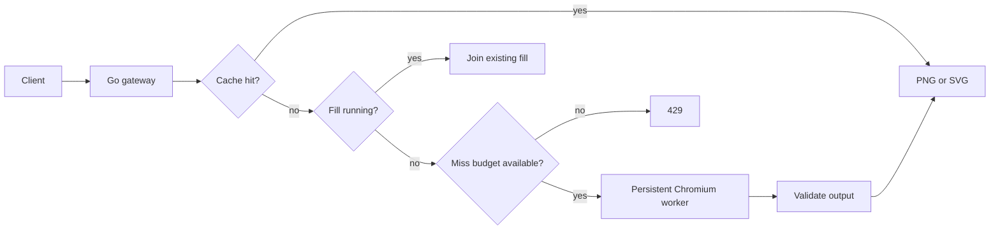

# Mermaid MCP

Mermaid MCP turns Mermaid source into PNG or SVG. You can call it through MCP or `POST /render`.

It uses the official Mermaid 11 renderer inside long-running Chromium workers. Chromium starts once per worker, not once per request. Repeated diagrams come from an in-memory cache without touching a browser.

Mermaid source is never stored. Optional URL delivery stores only validated image output in Cloudflare R2.

## Run it locally

You need Docker with Compose.

```sh
docker compose up --build -d
curl --fail http://127.0.0.1:8080/readyz
```

The ready response is:

```json
{"status":"ready"}
```

Compose binds the service to `127.0.0.1`. Other devices cannot reach it.

Render an SVG:

```sh
curl --fail-with-body \
  -H 'Content-Type: text/plain' \
  --data-binary 'graph TD; Client-->Server' \
  'http://127.0.0.1:8080/render?format=svg' \
  --output diagram.svg
```

Render a PNG:

```sh
curl --fail-with-body \
  -H 'Content-Type: application/json' \
  --data '{"diagram":"sequenceDiagram\nClient->>Server: Render","format":"png"}' \
  http://127.0.0.1:8080/render \
  --output diagram.png
```

Watch the service or stop it:

```sh
docker compose logs -f
docker compose down
```

## Connect an MCP client

Use the Streamable HTTP endpoint at `http://127.0.0.1:8080/mcp`:

```json
{
  "mcpServers": {
    "mermaid": {
      "type": "http",
      "url": "http://127.0.0.1:8080/mcp"
    }
  }
}
```

The server provides one tool named `render_mermaid`.

| Input | Required | Values |
| --- | --- | --- |
| `diagram` | yes | Mermaid source |
| `format` | no | `png` or `svg`; default `png` |
| `delivery` | no | `inline` or `url`; default `inline` |

`inline` returns MCP `ImageContent`. `url` returns an MCP `ResourceLink` with the MIME type, byte size, SHA-256, and expiry time. URL delivery works only when R2 is configured.

## How a request becomes an image

The shortest path has two parts. The Go gateway accepts the request. A renderer produces the image.



The gateway hashes every output-affecting input. A repeated request returns the cached bytes.



Only a new cache fill uses Chromium. Same-key requests join that fill instead of starting duplicate renders. Unique fills pass bounded client, replica, and optional cluster budgets.



The cache sits before browser admission. A slow render cannot consume every cheap request slot and block popular cached diagrams.

## Why it uses Chromium

The service promises official Mermaid 11 behavior. Mermaid relies on browser DOM APIs, CSS, fonts, SVG layout, and text measurement. Its official CLI render path uses Puppeteer and Chromium.

A browser-free renderer would be cheaper. The tested Rust renderer is fast, but it implements its own Mermaid parser and layout engine. It accepts some unsupported input without returning an error. A silent missing label or flattened group is worse than an explicit rejection when the API claims Mermaid 11 compatibility.

The worker pool removes most browser startup cost. Each worker keeps one Chromium process alive. Each request gets a fresh `BrowserContext` and page, which are closed after rendering. This costs more than page reuse but prevents cookies, cache, and page state from crossing requests.

A future fast engine can support a named, tested subset such as `fast-v1`. It must use a closed syntax classifier and differential tests against official Mermaid. It should not replace the compatibility renderer silently. See [the renderer decision](docs/high-scale/rendering.md) for the source-level comparison.

## Why misses are limited

Cached traffic is cheap. Unique hostile traffic is not.

A randomized diagram forces parsing, layout, output validation, and cache insertion. Unbounded autoscaling would turn that traffic into an unbounded bill. The service therefore returns `429` when a new-fill budget is full. Cache hits and same-key joins still work.

At 1,000 total requests per second:

| Local cache hits | New renders per second |
| ---: | ---: |
| 99.9% | 1 |
| 99% | 10 |
| 95% | 50 |
| 0% | 1,000 |

The committed four-CPU image rendered about 6.9 unique small diagrams per second at full CPU. The same service handled 7,227 repeated cached requests per second on two CPUs. The 1,000-request target depends on cache locality. It is not a claim of 1,000 unique renders per second.

Read [the measured cost estimate](docs/high-scale/cost.md) before raising miss limits.

## Choose a delivery mode

Use inline delivery for the broadest MCP compatibility. It needs no object store, but base64 adds about one third to the image bytes.

Use URL delivery when clients can fetch an asset and output bandwidth matters. The gateway checks R2 before rendering, so another replica's validated output can avoid a browser fill. Asset paths contain a daily HMAC instead of the diagram hash.

URL delivery has its own cost. Each new object adds R2 operations. Configure a one-day bucket lifecycle or objects accumulate after their expiry metadata becomes stale.

## HTTP API

### `POST /render`

Send one of these request types:

- `text/plain` contains Mermaid source. Select SVG with `?format=svg` or `Accept: image/svg+xml`.
- `application/json` contains `diagram` and an optional `format`.

A successful request returns raw `image/png` or `image/svg+xml` bytes. URL delivery is available only through MCP.

| Status | Meaning |
| --- | --- |
| `400` | Invalid source, JSON, or option |
| `413` | Input or output is too large |
| `415` | Unsupported content type |
| `422` | Mermaid or the output safety policy rejected the diagram |
| `429` | New-fill capacity or rate budget is full |
| `503` | HTTP ingress concurrency is full |
| `504` | Rendering exceeded its deadline |

### Service endpoints

| Endpoint | Purpose |
| --- | --- |
| `POST /mcp` | Stateless MCP Streamable HTTP |
| `GET /healthz` | Process liveness |
| `GET /readyz` | At least one renderer worker is ready |
| `GET /metrics` | Prometheus cache, fill, overload, and readiness metrics |

## Security model

This service accepts hostile input without authentication. No single check is the security boundary.

The gateway limits source bytes, output bytes, Mermaid text, edges, time, queues, processes, memory, and PID usage. It rejects caller configuration directives and unsafe SVG content.

Renderer workers receive an environment allowlist without gateway or R2 credentials. The Linux launcher applies a fail-closed seccomp filter to the renderer process tree. Chromium keeps its sandbox. Never add `--no-sandbox`.

Each render uses a fresh browser context. Go owns its private output directory and removes it after reading the image. Worker crashes, hangs, age, memory, and render count trigger replacement of the whole process group.

The production container needs a read-only root, bounded tmpfs, `no-new-privileges`, memory limits, and PID limits. Put a CDN or reverse proxy in front of public deployments. Enforce total request and byte limits there because the render-miss budget does not cap cached-response bandwidth.

See [the architecture and safety boundaries](docs/high-scale/architecture.md) for the full model.

## Core configuration

| Variable | Default | Purpose |
| --- | --- | --- |
| `ADDR` | `:$PORT` or `:8080` | Listen address |
| `RENDER_WORKERS` | `2` | Persistent Chromium workers |
| `RENDER_QUEUE_SIZE` | `4` | New fills waiting for a worker |
| `RENDER_TIMEOUT` | `20s` | Queue and render deadline |
| `MAX_IN_FLIGHT` | `64` | Cheap HTTP ingress concurrency |
| `MAX_DIAGRAM_BYTES` | `50000` | Decoded Mermaid source limit |
| `MAX_OUTPUT_BYTES` | `2097152` | Rendered output limit |
| `CACHE_MAX_BYTES` | `134217728` | Rendered-byte cache limit |
| `CACHE_MAX_ENTRIES` | `10000` | Cache entry limit |
| `CACHE_TTL` | `10m` | Successful output lifetime |
| `RENDER_MISS_RPS` | `5` | New fills per second per replica |
| `RENDER_MISS_BURST` | `6` | Replica fill burst |
| `CLIENT_RENDER_MISS_RPS` | `1` | Unique fills per client per second |
| `CLIENT_RENDER_MISS_BURST` | `3` | Client fill burst |
| `TRUSTED_CLIENT_IP_HEADER` | unset | Sanitized client IP header from a trusted proxy |

`MAX_IN_FLIGHT` must cover `RENDER_WORKERS + RENDER_QUEUE_SIZE`. Set `TRUSTED_CLIENT_IP_HEADER` only when the ingress proxy overwrites the header. The Fly baseline uses `Fly-Client-IP`.

Worker recycling uses `WORKER_MAX_RENDERS`, `WORKER_MAX_AGE`, and `WORKER_MAX_RSS_BYTES`. The production image sets an immutable `RENDERER_BUNDLE_ID` from the pinned renderer stack. Change that ID after any renderer, font, or output-policy change.

### Shared cluster budget

Deploy [`deploy/cloudflare-admission`](deploy/cloudflare-admission) for a public multi-replica service. It uses one Durable Object to enforce minute and UTC-day fill limits.

Set `CLUSTER_ADMISSION_URL` and a `CLUSTER_ADMISSION_TOKEN` of at least 32 bytes on every replica. Admission failures return `429` without starting Chromium.

### R2 URL delivery

Set all of these variables together:

| Variable | Purpose |
| --- | --- |
| `R2_ENDPOINT` | R2 S3 API endpoint |
| `R2_ACCESS_KEY_ID` | Bucket-scoped credential |
| `R2_SECRET_ACCESS_KEY` | Bucket-scoped credential |
| `R2_BUCKET` | Private origin bucket |
| `ASSET_PUBLIC_BASE_URL` | Cookieless custom domain |
| `ASSET_HMAC_KEY` | Base64 for at least 32 random bytes |

Generate the path-signing key:

```sh
openssl rand -base64 32
```

Disable bucket listing. Permit public `GET` and `HEAD` only through the custom domain. Configure a one-day lifecycle. Never pass storage credentials to renderer workers.

## Run without Docker

Docker is the supported secure path. A direct development run needs Go 1.25+, Node 22.12+, Chromium, and the exact packages in `renderer/package-lock.json`.

```sh
cd renderer && npm ci
cd ..
WORKER_NETWORK_ISOLATION=false go run ./cmd/mermaid-mcp
```

This command disables the Linux isolation launcher. Use it only for local development. Never use it for a public deployment.

## Test changes

Run the fast checks:

```sh
go fmt ./...
go vet ./...
go test -race ./...
node --check renderer/worker.mjs
```

Run the production-image checks:

```sh
docker build -t mermaid-mcp .
docker run --rm --entrypoint node mermaid-mcp /app/containment-test.mjs
docker run --rm --user node --entrypoint renderer-launcher \
  mermaid-mcp /usr/local/bin/node /app/network-isolation-test.mjs
```

Measure cache hits:

```sh
go run ./cmd/loadtest \
  -target http://127.0.0.1:8080/render \
  -requests 10000 \
  -concurrency 64 \
  -format svg
```

Add `-unique` to measure admission and unique-fill capacity. Expected `429` responses make that command exit nonzero.

## Deploy on Fly.io

`fly.toml` defines two warm `performance-4x` Machines in `iad`. It disables scale-to-zero and checks renderer readiness.

```sh
fly apps create YOUR_APP
fly deploy --app YOUR_APP \
  --build-arg VERSION="$(git rev-parse --short=12 HEAD)"
fly scale count 2 --app YOUR_APP
```

Configure the shared fill budget before a public multi-replica launch. Put an edge proxy in front of Fly. Keep a fixed Machine maximum and billing alerts.

Run the unique-input load test on Fly before buying reservations or raising admission. Local Docker measurements are not Fly capacity guarantees.

## Read the design record

- [Renderer choice and rejected alternatives](docs/high-scale/rendering.md)
- [Cache, MCP delivery, and abuse controls](docs/high-scale/protocol-cache.md)
- [Measured architecture](docs/high-scale/architecture.md)
- [Monthly cost model](docs/high-scale/cost.md)
- [Initial dependency research](docs/research.md)

## License

[MIT](LICENSE)
